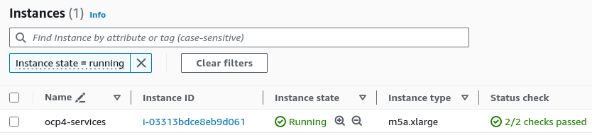

# Install OpenShift on AWS in a restricted network with user-provisioned infrastructure

TODO: intro

## Prerequisites

* Ansible
* ```python3-psycopg2``` & ```python3-passlib``` packages

### Configure Ansible

```shell
export ANSIBLE_CONFIG=$PWD/disconnected-on-aws/ansible/ansible.cfg
```

```shell
ansible-galaxy collection install -r ./disconnected-on-aws/ansible/requirements.yml
```

### Configure AWS & OpenShift

```shell
export AWS_ACCESS_KEY_ID=<change it>
export AWS_SECRET_ACCESS_KEY=<change it>
export AWS_DEFAULT_REGION=eu-west-1 # use your region
export OPENSHIFT_BASE_DOMAIN=sandboxXXXX.opentlc.com
export OPENSHIFT_PULL_SECRET='{"auths":...}'
```

## Usage

Choose a name for the cluster to create:

```shell
export CLUSTER_NAME=<name>
```

### All-in-one playbook

To use Quay as the mirror and install an OpenShift cluster in disconnected mode:

```shell
ansible-playbook disconnected-on-aws/ansible/playbooks/disconnected-ocp4-quay.yml
```

To use Harbor as the mirror and install an OpenShift cluster in disconnected mode:

```shell
ansible-playbook disconnected-on-aws/ansible/playbooks/disconnected-ocp4-harbor.yml
```

## Step-by-step usage

### Create custom VPC

We need a VPC with a public network (to put the Quay in semi-disconnected mode) and a private network for the disconnected OpenShift cluster:

```shell
ansible-playbook disconnected-on-aws/ansible/playbooks/network/vpc-for-ocp.yml
```

> This playbook will write an Ansible inventory with VPC information variables in `disconnected-on-aws/ansible/inventory/vpc.yml` file

### Create an EC2 instance for the transverse services (HAProxy, httpd, Quay...)

```shell
ansible-playbook disconnected-on-aws/ansible/playbooks/bastion/create.yml
```

> This playbook will write an Ansible inventory `disconnected-on-aws/ansible/inventory/bastion.yml` file

> You can check the status of the created instance in the AWS EC2 console:
>
> 

TODO: Add your SSH key in authorized keys of the machine.

### Configure the transverse services (HAProxy, httpd, OpenShift CLIs...)

When the [status check of the transverse services machine are OK](#create-an-ec2-instance-for-the-transverse-services-haproxy-httpd-quay), run:

```shell
ansible-playbook disconnected-on-aws/ansible/playbooks/bastion/install.yml
```

### Install an OCI registry on the created EC2 instance

You can choose to use either Quay (installed via *mirror-registry* with Podman) or Harbor (installed with Docker).

#### Quay

```shell
ansible-playbook disconnected-on-aws/ansible/playbooks/quay/install.yml
```

#### Harbor

```shell
ansible-playbook disconnected-on-aws/ansible/playbooks/harbor/install.yml
```

### Mirror OpenShift release images

#### Quay

```shell
ansible-playbook disconnected-on-aws/ansible/playbooks/quay/create-mirror.yml
```

#### Harbor

```shell
ansible-playbook disconnected-on-aws/ansible/playbooks/harbor/create-mirror.yml
```

### Prepare OpenShift installation (install-config.yaml, manifests, ignitions)

```shell
ansible-playbook disconnected-on-aws/ansible/playbooks/ocp4/prepare-installation.yml
```

### Create the DNS records in Route53

```shell
ansible-playbook disconnected-on-aws/ansible/playbooks/ocp4/dns-and-lbs.yml
```

### Create the EC2 instances for the OCP4 cluster

```shell
ansible-playbook disconnected-on-aws/ansible/playbooks/ocp4/create-vms.yml
```

## Tear down

