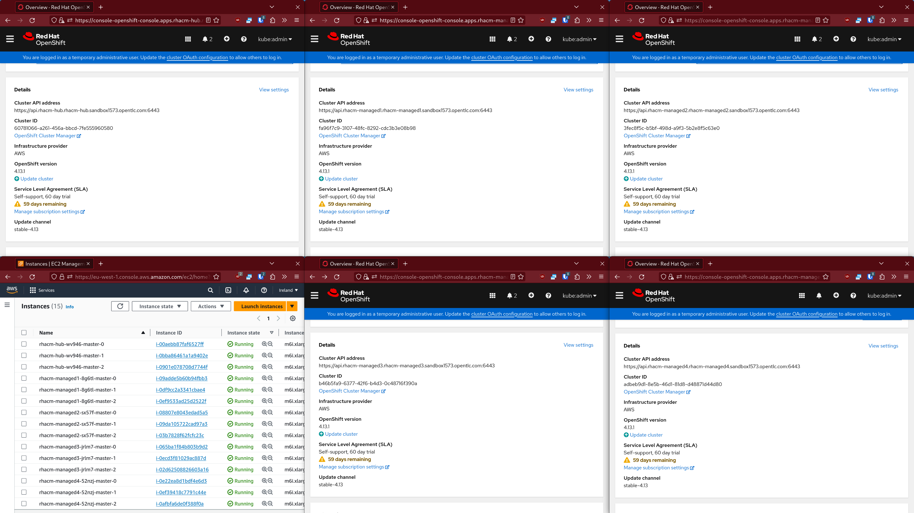

# Create a minimal fleet of OpenShift clusters in AWS using IPI

This repository aims to create **several** OpenShift clusters seamlessly in an AWS landing zone.

It allows the use of only one elastic IP per cluster and thus bypasses any quota on this resource. Indeed, a cluster consumes one IP per availability zone, that is to say 3 in general. If the quota is 5 IPs, then it is impossible to create more than one cluster in the landing zone.

It does this by creating custom VPCs and specific public DNS zones using Ansible playbooks.

The installation itself is done using the IPI method after creating the *install-config.yaml* configuration file automatically.


*5 OpenShift clusters (1 hub and 4 managed)*

## Prerequisites

* [openshift-install CLI](https://mirror.openshift.com/pub/openshift-v4/clients/ocp/latest/)
* Ansible
* Python 3 botocore & boto3 packages

### Configure AWS & OpenShift

```shell
export AWS_ACCESS_KEY_ID=<change it>
export AWS_SECRET_ACCESS_KEY=<change it>
export AWS_DEFAULT_REGION=eu-west-1 # use your region
export OPENSHIFT_BASE_DOMAIN=sandboxXXXX.opentlc.com
export OPENSHIFT_PULL_SECRET='{"auths":...}'
```

### Configure Ansible

```shell
ansible-galaxy collection install -r ./fleet-on-aws/ansible/requirements.yml
```

## TL;DR

A **do-it-all script** can be used to **bootstrap a minimal fleet** composed of 1 hub cluster (3 master nodes) and 3 managed clusters (single node):

```shell
./fleet-on-aws/samples/1hub+3managed-SNO.sh
```

> First, AWS dependency resources (VPC, DNS public hosted zone) are created sequentially, then the OpenShift installer is invoked in parallel for each cluster. Do not exit the current shell until all installations are complete

This is probably the **least expensive configuration to have a fleet of clusters** which can then be administered with RHACM for example.

Moreover, since the installations are executed in parallel, the **total duration does not exceed 30 minutes**.

## Usage

Choose a name for the cluster to create:

```shell
export CLUSTER_NAME=<name>
```

> The created cluster will be reachable at https://console-openshift-console.apps.$CLUSTER_NAME.$CLUSTER_NAME.$OPENSHIFT_BASE_DOMAIN
>
> For instance: https://console-openshift-console.apps.rhacm-hub.rhacm-hub.sandboxXXXX.opentlc.com

### Create custom VPCs

To reduce the use of elastic IPs, it is necessary to create custom VPCs.

The following playbook will create one VPC on two AZs (*a* & *b* in the default region set with *AWS_DEFAULT_REGION* environment variable, for instance *eu-west-1a* & *eu-west-1b*) with a pair of public & private subnets in each AZ and a single NAT gateway (one elastic IP) in the first public subnet:

```shell
ansible-playbook ./fleet-on-aws/ansible/playbooks/vpc-for-ocp.yml
```

> The NAT gateway gives access to the Internet from the private subnets of the VPC but not the other way around. A NAT gateway is created in a public subnet and the private subnets have custom routing tables through this gateway

> The Ansible playbook have input variables to customize its behaviour, for instance to build a VPC with 2 pairs of subnets (public & private) in the AZ *a* and *c* with one NAT gateway in each AZ (this will consume two elastic IPs):
> ```shell
> ansible-playbook ./fleet-on-aws/ansible/playbooks/vpc-for-ocp.yml -e "{nat_gateway_in_each_az: true, azs: [a,c]}"
> ```

### Create Route53 public zone with DNS delegation in the parent zone

An OpenShift cluster installed in AWS using IPI method needs to write some DNS records in a publicly hosted zone associated with its base domain (as defined by *baseDomain* in the *install-config.yaml* file).

As we want to install several clusters with different base domains, those records would overlap (at least the OpenShift installer won't accept to use a single public hosted zone for different clusters).

If the AWS landing zone can only have one public hosted zone associated with a domain, a workaround is to create distinct public hosted zones associated with subdomains of this domain and to perform DNS delegation in the main public hosted zone.

The following Ansible playbook will perform this workaround:

```shell
ansible-playbook ./fleet-on-aws/ansible/playbooks/public-hosted-zone-for-ocp.yml
```

### Create the *install-config.yaml*

A script will generate the *install-config.yaml* automatically:

```shell
./fleet-on-aws/generate-install-config.sh
```

> The script will source the file generated by the [custom VPC creation Ansible playbook](#create-custom-vpcs) to include the subnets of the VPC in the generated *install-config.yaml*

Now that the *install-config.yaml* file is generated, it is possible to **customize it** (for instance choose AWS EC2 instance size, add some workers...).

### Create the infrastructure and install OpenShift

The OpenShift Installer can be used to launch the installation the IPI way (Installer Provisioned Infrastructure):

```shell
openshift-install create cluster --dir ./fleet-on-aws/clusters/$CLUSTER_NAME --log-level=INFO
```

## Tear down

To destroy an OpenShift cluster, simply use the OpenShift installer CLI:

```shell
openshift-install destroy cluster --dir ./fleet-on-aws/clusters/$CLUSTER_NAME --log-level=INFO
```
> Change CLUSTER_NAME to the name of the cluster to delete

> Currently, resources created by Ansible playbooks in the AWS landing zone need to be deleted manually